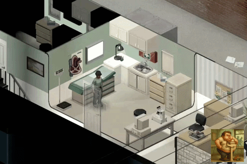

# Dead Weight

*Step on the scale. Face the truth.*

A small Project Zomboid mod: step on a working medical scale and your exact
body weight appears on screen, to one decimal, in a brass and cream beam
head readout that settles like the real thing. Walk off and the number
goes with you; nowhere else in the game can you read it that precisely.

## Features

- A brass and cream beam head readout, the poise sliding to your weight and
  settling instead of snapping, because a real scale wobbles.
- One decimal of precision.
- Your unit and display style are remembered between sessions.
- The character screen's Info tab shows only your weight category in words
  (Emaciated to Very High Weight) with its trend arrow; the exact number
  stays on the scale.
- Your survivor turns once to face the scale's column on stopping.
- Two short sounds: stepping on, stepping off.
- A "Step on Scale" option at the top of the scale's right click menu, with
  its own icon, walks you there.
- Every local splitscreen player gets their own readout.
- No per frame scanning: the reading only exists while you are standing on
  the scale.
- 28 languages, every one the game ships.

## Controls

- Left click the readout: switch between kg and lb.
- Right click the readout: switch between the beam head look and a plain
  native panel.

## Compatibility

Built for Build 42, keeps Build 41 support. Singleplayer and multiplayer
(client side), splitscreen aware. If another mod replaces the character
screen, this fails safe: the scale keeps working and the Info tab simply
stays as that mod or vanilla draws it. Incompatible with the original
"Weight Scale" mod (item based, full nutrition panel): disable it first,
the two should not run together.

## Install

**From the Steam Workshop.** <!-- workshop-link:start -->Coming soon (not yet uploaded).<!-- workshop-link:end -->

**Manual install.** Copy the `42/` folder's contents into a new folder under
`~/Zomboid/mods/DeadWeight/` (create `mod.info`, `poster.png` and `media/`
there from `42/mod.info`, `42/poster.png` and `42/media/`), or, for Build 41,
copy the repository root's own `mod.info`, `poster.png` and `media/` the same
way into `~/Zomboid/mods/DeadWeight/`. Then enable **Dead Weight** in the mod
list.

## Development

The repository root is the mod folder itself, laid out so Build 41 and
Build 42 can load from the same copy.

- `src/` is the single source of truth: Lua modules, textures, sounds,
  sound scripts and translations. **Never hand edit `media/`, `42/media/`
  or `common/media/textures`, they are generated.**
- `tools/sync.sh` regenerates the Build 41 tree (root `mod.info`, `media/`)
  and the Build 42 tree (`42/`, `common/`) from `src/`. Run it after any
  change under `src/`.
- `tools/check-sync.sh` fails if the generated trees have drifted from
  `src/`.
- `tools/gen-geo.py` regenerates the HUD geometry from the approved
  maquette's `docs/maquettes/v2/assets/geometry.json`; never hand edit
  `WeightScaleGeo.lua`.
- `bash tests/run.sh` runs the full bench: the Lua unit suites, the
  mod.info guard, the translation bench, the workshop.txt drift check and
  the JS/Lua parity check against the maquette's own sampler. Must exit 0
  before any commit.
- `tools/pack-workshop.sh` stages the upload copy under
  `~/Zomboid/Workshop/DeadWeight/` (`--check` for a dry run, `--clean` to
  remove it). Rerun it after any change before testing in game: once a
  staged copy and the repo copy share the same mod id, the game loads the
  staged copy, not the repo.
- `workshop/description.bbcode` is the hand edited source of the Workshop
  page text; `tools/gen-workshop-txt.py` regenerates the `description=`
  lines of `workshop/workshop.txt` from it and from `workshop/gif_url.txt`.
  Paste the presentation gif's public URL into `gif_url.txt` once it is
  known (the raw URL once this repository is public, or the URL Steam
  gives the gif once it is added to the Workshop item's own image
  gallery); an empty file emits no `[img]` tag rather than a broken one.
  The description's own [Source](https://github.com/Konijima/pz-dead-weight)
  link points bug reports and translation fixes back here.

**After the Workshop upload.** Run `tools/set-workshop-id.sh` (no argument:
it reads the id Steam wrote into the staged copy). It records the id in
`workshop/workshop_id.txt`, fills the description's "Workshop ID:" line
and the README link above. Then drop the presentation gif's Steam URL
into `workshop/gif_url.txt`, rerun `tools/pack-workshop.sh`, and commit and
push.

## Credits

Made by Konijima. Art (the beam head textures, poster and icon) generated
with an AI image model. Sounds (stepping on and off the scale) generated
with an AI sound model.

## Licence

All rights reserved, see [LICENSE](LICENSE): read it, play it, send pull
requests from a fork; do not redistribute it or reupload it to the
Workshop.

