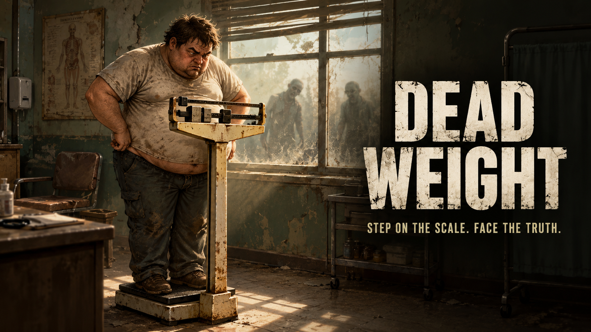
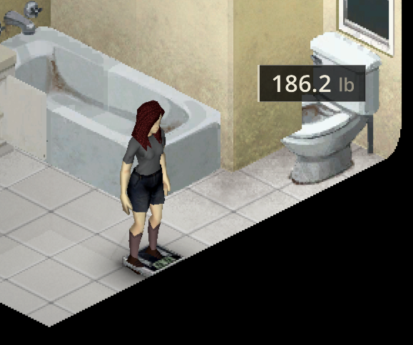
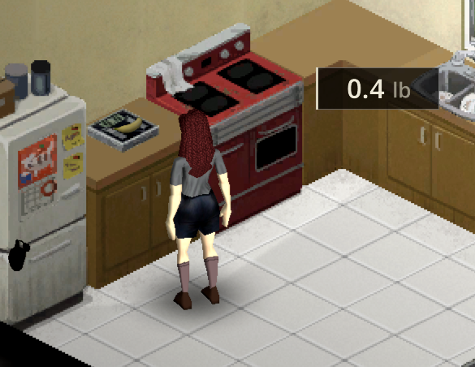
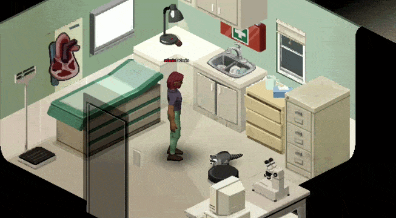
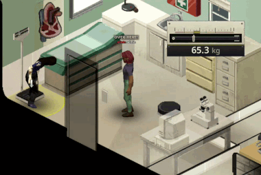
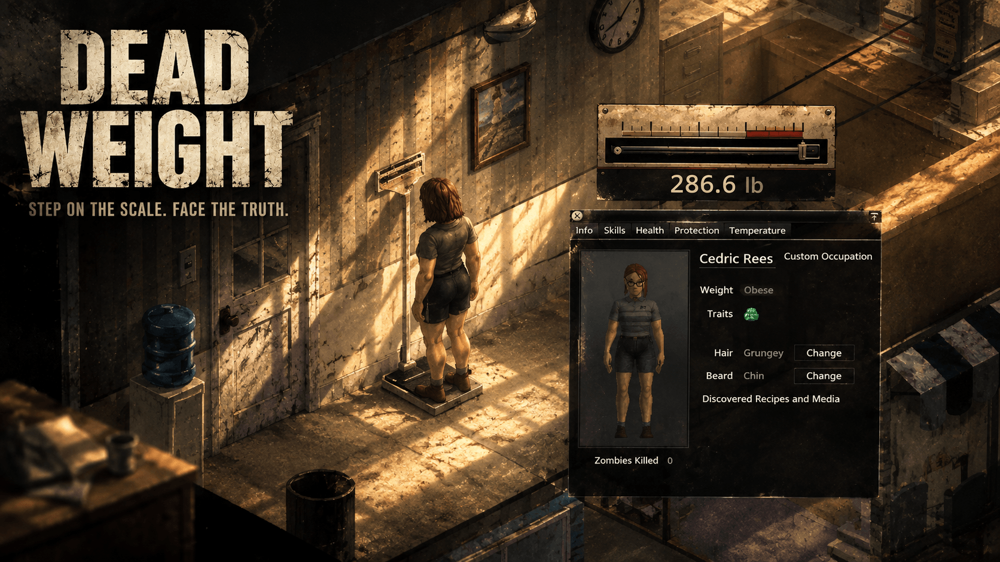

# Dead Weight

*Step on the scale. Face the truth.*

A small Project Zomboid mod: step on a working medical scale and your exact
body weight appears on screen, to one decimal, in a brass and cream beam
head readout that settles like the real thing. Walk off and the number
goes with you; nowhere else in the game can you read it that precisely.

## Features

- A brass and cream beam head readout, the poise sliding to your weight and
  settling instead of snapping, because a real scale wobbles.
- One decimal of precision.
- Your unit choice (kg or lb) is remembered between sessions. Each scale has
  its own look: the clinic scale its beam head, the Digital Scale a plain
  native panel.
- New in 1.3.0, Build 42 only: the Digital Scale, a small home scale you can
  place on the floor or on a counter, see below.
- The character screen's Info tab shows only your weight category in words
  (Emaciated to Obese) with its trend arrow; the exact number stays on the
  scale.
- Your survivor turns once to face the scale's column on stopping.
- Two short sounds: stepping on, stepping off.
- A "Step on Scale" option at the top of the scale's right click menu, with
  its own icon, walks you there. Holding an animal (Build 42), a "Put Animal
  on Scale" option sets it down on the plate from the next square (single player for now), so it is
  weighed without you.
- Every local splitscreen player gets their own readout.
- The scale reads everyone on it: survivors, animals and zombies, added up.
  Stand next to it (a sandbox option, 1 by default, blocked by
  walls and shut doors) and you read them too, like a doctor weighing a
  patient.
- No per frame scanning: the reading only exists while someone is on the
  scale and you are next to it.
- 28 languages, every one the game ships.

## The Digital Scale (Build 42 only)

A small bathroom scale, furniture you place, turn (four facings) and pick up
again, on the floor or on a counter. It reads 0 to 130 kg on a plain native
panel; the clinic scale keeps its beam head. On the floor it weighs people,
animals and zombies standing on it, and items lying on it; on a counter it
weighs the items you set on it (they are lifted onto its plate), and a
survivor walking through a counter scale's square is not weighed, though
climbing through a window over it reads. Stepping onto a Digital Scale turns
you to look at its screen, and you only read a scale you are facing: turn
away and the readout goes, turn back and it returns.

It also turns up in the world, only in new loot and in areas of the map nobody
has explored yet (a room you already visited never gets one), only in homes
and motels, never in a public restroom, and never in front of a toilet, basin
or other fixture:

- inside bathroom counters (the cupboards under a basin), a counter never
  holding two and a bathroom giving out at most one from its counters;
- on the floor against a wall in a big enough bathroom.

Build 41 has no Digital Scale, only the clinic scale.

## Weigh others, and anything else

Whatever stands or lies on the scale's plate is weighed, and anyone standing
on it or within reach in the same room and in plain sight (2 squares by
default) reads the same number, in multiplayer too. With two scales side by
side, you read the nearest one that has something on it. Two survivors together
read their true combined weight: the beam rests at its end and the number
stays honest. A light animal reads under 35 kg, a heavy pair over 130 kg.

A zombie has no weight in the game, so each one gets a believable invented
weight, the same every time you see it. Everyone who can see the readout hears
the sound when the scale goes from empty to occupied or back.

## Sandbox options

Page "Dead Weight" in the sandbox options:

- **Weigh what you carry** (on by default): adds worn items and bag contents
  to each survivor's reading, so strip naked to read your true body weight. Zombies and animals stay body weight only.
- **Weigh the whole square** (off by default): count anything in the scale's
  square instead of only what is on the plate.
- **Reading distance** (0 to 5, default 1): how many squares away you can
  stand and still read the scale.
- **Digital Scale in bathroom counters** (0 to 20, default 3, Build 42 only):
  the weight of the Digital Scale in bathroom counter loot; 0 is never.
- **Digital Scale on bathroom floors** (percent, default 20, Build 42 only):
  the chance that a big enough home or motel bathroom, in an area of the map
  nobody has explored, gets a Digital Scale standing on its floor; 0 is
  never.

## Controls

- Left click the readout: switch between kg and lb.

## Compatibility

Built for Build 42, keeps Build 41 support (the Digital Scale is Build 42 only). Singleplayer and multiplayer
(client side), splitscreen aware. If another mod replaces the character
screen, this fails safe: the scale keeps working and the Info tab simply
stays as that mod or vanilla draws it. Incompatible with the original
"Weight Scale" mod (item based, full nutrition panel): disable it first,
the two should not run together.

## Install

**From the Steam Workshop.** <!-- workshop-link:start -->[Dead Weight on the Steam Workshop](https://steamcommunity.com/sharedfiles/filedetails/?id=3804074600).<!-- workshop-link:end -->

**Manual install.** Copy the `42/` folder's contents into a new folder under
`~/Zomboid/mods/DeadWeight/` (create `mod.info`, `poster.png` and `media/`
there from `42/mod.info`, `42/poster.png` and `42/media/`), or, for Build 41,
copy the repository root's own `mod.info`, `poster.png` and `media/` the same
way into `~/Zomboid/mods/DeadWeight/`. Then enable **Dead Weight** in the mod
list.

## Development

The repository root is the mod folder itself, laid out so Build 41 and
Build 42 can load from the same copy.

- `src/` is the single source of truth: Lua modules, textures, sounds,
  sound scripts and translations. **Never hand edit `media/`, `42/media/`
  or `common/media/textures`, they are generated.**
- `tools/sync.sh` regenerates the Build 41 tree (root `mod.info`, `media/`)
  and the Build 42 tree (`42/`, `common/`) from `src/`. Run it after any
  change under `src/`.
- `tools/check-sync.sh` fails if the generated trees have drifted from
  `src/`.
- `tools/gen-geo.py` regenerates the HUD geometry from the approved
  maquette's `docs/maquettes/v2/assets/geometry.json`; never hand edit
  `WeightScaleGeo.lua`.
- `bash tests/run.sh` runs the full bench: the Lua unit suites, the
  mod.info guard, the translation bench, the workshop.txt drift check and
  the JS/Lua parity check against the maquette's own sampler. Must exit 0
  before any commit.
- `tools/pack-workshop.sh` stages the upload copy under
  `~/Zomboid/Workshop/DeadWeight/` (`--check` for a dry run, `--clean` to
  remove it). Rerun it after any change before testing in game: once a
  staged copy and the repo copy share the same mod id, the game loads the
  staged copy, not the repo.
- `workshop/art/deadweight-banner.png` and `workshop/art/deadweight-banner-2.png`
  are the Workshop page banners (also the README images above); neither is
  shipped to players, see the `pack-workshop.sh` bullet above.
- `workshop/art/320/` holds the images the Workshop page shows, scaled to 320 px
  wide (a wider image makes Steam's mobile page scroll sideways);
  `tools/gen-workshop-art.py` regenerates them from the full size originals in
  `workshop/art/`, which the README uses. A new Workshop image goes into that
  script's list. `deadweight-sprites.png` there (the clinic scale next to the
  Digital Scale's four faces) comes from `tools/gen-workshop-sprites.py`, which
  needs a Project Zomboid install.
- `workshop/description.bbcode` is the hand edited source of the Workshop
  page text; `tools/gen-workshop-txt.py` regenerates the `description=`
  lines of `workshop/workshop.txt` from it and from `workshop/gif_url.txt`,
  which already holds the gif's raw GitHub URL
  (`https://raw.githubusercontent.com/Konijima/pz-dead-weight/main/workshop/art/320/deadweight-animation.gif`);
  an empty file emits no `[img]` tag rather than a broken one. That URL
  only resolves once this repository is public, so **at release, make the
  repository public before making the Workshop item public**, or Steam
  shows, and may cache, a broken image. The description's own
  [Source](https://github.com/Konijima/pz-dead-weight) link points bug
  reports and translation fixes back here.

**After the Workshop upload.** Run `tools/set-workshop-id.sh` (no argument:
it reads the id Steam wrote into the staged copy). It records the id in
`workshop/workshop_id.txt`, fills the description's "Workshop ID:" line
and the README link above. `workshop/gif_url.txt` needs no change at that
point (it already carries the repo's raw gif URL); rerun
`tools/pack-workshop.sh`, and commit and push.

**Releasing (change notes).** Every player visible change gets a line
under `CHANGELOG.md`'s `Unreleased` heading as it lands, in plain player
words. To cut a release:

1. Move the `Unreleased` lines under a new `## <version> - <date>` heading.
2. Bump `modversion=` in `42/mod.info` (and the root `mod.info`) to match.
3. `bash tests/run.sh` (the changelog bench checks the two agree).
4. `python3 tools/changelog-steam.py` prints the new section as a Steam
   change note and writes it to `workshop/changenote.txt`.
5. `bash tools/pack-workshop.sh` stages the upload and, at the end, prints
   the path to `workshop/changenote.txt` again.
6. Upload from the game (main menu, Workshop, Submit item), and on the
   changelog page of that screen, paste the contents of
   `workshop/changenote.txt` into the text box. **Proven** (client
   install's `WorkshopSubmitScreen.lua`, `SteamWorkshopItem.java`): the
   change note is a plain string typed or pasted into a multi-line
   `ISTextEntryBox` (it takes paste, and up to 512 lines); it is sent
   straight to Steam by `item:submitUpdate()`, never read from
   `workshop.txt` or any other staged file, and the game takes one even on
   the very first upload of a brand new item (it creates the item, then
   immediately submits the same update). No BBCode is parsed on this path
   and no client side length limit was found, so the note is plain text.
7. Commit and push.

**Making the item public.** The uploader reads `visibility=` from the
staged `workshop.txt` on every submit and writes it straight back
(**proven**, `SteamWorkshopItem.java`: `readWorkshopTxt` loads it,
`writeWorkshopTxt` saves it, both run on every Submit item pass). So
flipping the item to public from its own Steam page is not enough on its
own: set `visibility=public` in `workshop/workshop.txt` here too, or the
next upload resubmits `visibility=private` and flips it back.

## Credits

Made by Konijima. Art (the beam head textures, poster and icon) generated
with an AI image model. Sounds (stepping on and off the scale) generated
with an AI sound model.

## Licence

All rights reserved, see [LICENSE](LICENSE): read it, play it, send pull
requests from a fork; do not redistribute it or reupload it to the
Workshop.

